<div align="center">


<br />
<br />

[](#visión-general)
[](#experiencia-de-reserva)
[](#arquitectura)
[](#referencia-api)
[](#stack-tecnológico)
[](#instalación)
[](#desarrollo)

<br />


</div>

<br />


## Visión general

**Omega Complex** digitaliza la experiencia completa de un complejo deportivo y recreativo: desde consultar un servicio hasta cruzar la puerta con un código QR validado.

El objetivo es que el usuario complete su reserva con la menor fricción posible, mientras el equipo operativo controla accesos, horarios y capacidad desde un único lugar.

<table>
<tr>
<td width="33%" valign="top">

### Cliente

Explora servicios, consulta disponibilidad en tiempo real, reserva por fecha y horario, paga en línea y recibe su código QR de acceso.

</td>
<td width="33%" valign="top">

### Empleado

Escanea el QR en la entrada y valida en segundos la reserva, el horario y el uso previo del código.

</td>
<td width="33%" valign="top">

### Administrador

Gestiona servicios, instalaciones, horarios, reservas y empleados desde un panel centralizado.

</td>
</tr>
</table>


## Experiencia de reserva

El recorrido completo, de la consulta al acceso:

<div align="center">
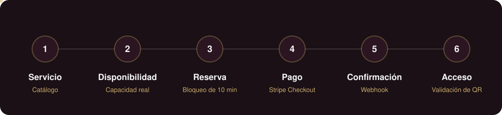
</div>

<br />

La disponibilidad y el estado definitivo de cada reserva son responsabilidad exclusiva del backend. El navegador nunca decide si una reserva queda confirmada.

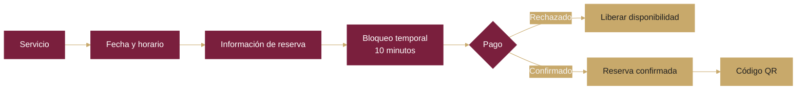


## Funcionalidades

<details open>
<summary><strong>Cliente</strong></summary>

<br />

| Funcionalidad              | Estado        |
| -------------------------- | ------------- |
| Registro                   | **Disponible** |
| Inicio de sesión           | **Disponible** |
| Consulta de servicios      | **Disponible** |
| Consulta de disponibilidad | **Disponible** |
| Perfil                     | **Disponible** |
| Recuperación de contraseña | En desarrollo |
| Verificación de correo     | En desarrollo |
| Reservas                   | En desarrollo |
| Pagos                      | En desarrollo |
| Código QR                  | En desarrollo |
| Mis reservas               | En desarrollo |
| Historial de reservas      | En desarrollo |

</details>

<details>
<summary><strong>Empleado</strong></summary>

<br />

| Funcionalidad         | Estado        |
| --------------------- | ------------- |
| Autenticación por rol | **Disponible** |
| Escaneo de QR         | En desarrollo |
| Validación de reserva | En desarrollo |
| Validación de horario | En desarrollo |
| Registro de acceso    | En desarrollo |

</details>

<details>
<summary><strong>Administrador</strong></summary>

<br />

| Funcionalidad            | Estado        |
| ------------------------ | ------------- |
| Dashboard                | En desarrollo |
| Gestión de servicios     | En desarrollo |
| Gestión de instalaciones | En desarrollo |
| Gestión de horarios      | En desarrollo |
| Gestión de reservas      | En desarrollo |
| Gestión de empleados     | En desarrollo |
| Información operativa    | En desarrollo |

</details>

<br />

### Estado del desarrollo

<div align="center">
</div>

<sub>Los porcentajes son una representación del avance actual y se actualizan conforme progresa la implementación.</sub>


## Arquitectura

Omega Complex se organiza por dominios mediante **vertical slices**. Cada feature contiene su propia lógica, validación y acceso a datos.

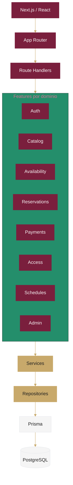

### Principio de separación

| Capa              | Responsabilidad                                         |
| ----------------- | ------------------------------------------------------- |
| Presentation      | Páginas y componentes. Sin lógica de negocio compleja.  |
| Route Handler     | Entrada HTTP, validación y respuesta.                   |
| Feature Service   | Reglas de negocio del dominio.                          |
| Repository        | Acceso a datos.                                         |
| Prisma            | ORM y consultas. Nunca se invoca desde la UI.           |
| PostgreSQL        | Persistencia.                                           |

### Comunicación HTTP

El proyecto usa **Axios** como cliente HTTP y no incorpora TanStack Query en esta etapa. Si más adelante aparecen necesidades de caché, revalidación, polling o sincronización avanzada de server state, se evaluará una herramienta especializada.

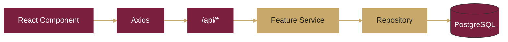

<details>
<summary><strong>Estructura del proyecto</strong></summary>

<br />

```text
src/
├── app/
│   ├── (auth)/          forgot-password, login, register, reset-password, verify-email
│   ├── (customer)/      reservas
│   ├── (employee)/      validar
│   ├── (piscinas)/      informacion, mis-reservas, perfil, piscinas, servicios, tour
│   ├── (public)/
│   └── api/             access, auth, availability, categories, facilities, payments, pools, reservations
│
├── components/          auth, piscinas, ui
├── features/            access, admin, auth, availability, catalog, payments, reservations, schedules
├── lib/                 api, piscinas
├── shared/              auth, http, lib, ui
├── types/               auth.ts, piscinas
└── middleware.ts
```

</details>


## Stack tecnológico

<div align="center">


</div>

<br />

| Categoría      | Tecnología                          |
| -------------- | ----------------------------------- |
| Framework      | Next.js App Router                  |
| Frontend       | React 19.2                          |
| Lenguaje       | TypeScript 5, modo estricto         |
| Estilos        | Tailwind CSS v4, shadcn/ui          |
| Iconografía    | Lucide React                        |
| Animaciones    | Motion                              |
| Formularios    | React Hook Form, Zod                |
| Cliente HTTP   | Axios                               |
| Estado global  | Zustand                             |
| Fechas         | date-fns, React Day Picker          |
| Notificaciones | Sonner                              |
| QR             | qrcode.react                        |
| Gráficas       | Recharts                            |
| Backend        | Next.js Route Handlers              |
| ORM            | Prisma 6.19                         |
| Base de datos  | PostgreSQL / Supabase               |
| Autenticación  | jose, bcryptjs                      |
| Pagos          | Stripe                              |
| Pruebas        | Vitest, Playwright                  |


## Dominio

### Autenticación y roles

Omega Complex implementa autenticación propia con `bcryptjs` para contraseñas y `jose` para JWT de 7 días, guardados en cookies `HttpOnly` con `SameSite=Lax`. Un middleware protege las rutas y aplica autorización por rol.

| Rol           | Área                   | Ruta de entrada       |
| ------------- | ---------------------- | --------------------- |
| Usuario       | Cliente                | `/piscinas/inicio`    |
| Empleado      | Validación de acceso   | `/validar`            |
| Administrador | Administración         | `/piscinas/dashboard` |

### Reservas

La disponibilidad de un servicio es el resultado de combinar servicio, fecha, horario, capacidad, reservas existentes, bloqueos temporales y estado de cada reserva.

| Regla                | Valor         |
| -------------------- | ------------- |
| Anticipación máxima  | 3 meses       |
| Horario              | 08:00 a 17:00 |
| Mantenimiento        | Lunes         |
| Duración del bloqueo | 10 minutos    |
| Cobro                | Por hora      |

> Si un lunes es festivo, el mantenimiento se desplaza al martes.

### Pagos

Stripe es el proveedor de pagos. El estado de una reserva **no** se confirma por el retorno del navegador tras el checkout: **el webhook es la fuente de verdad**.

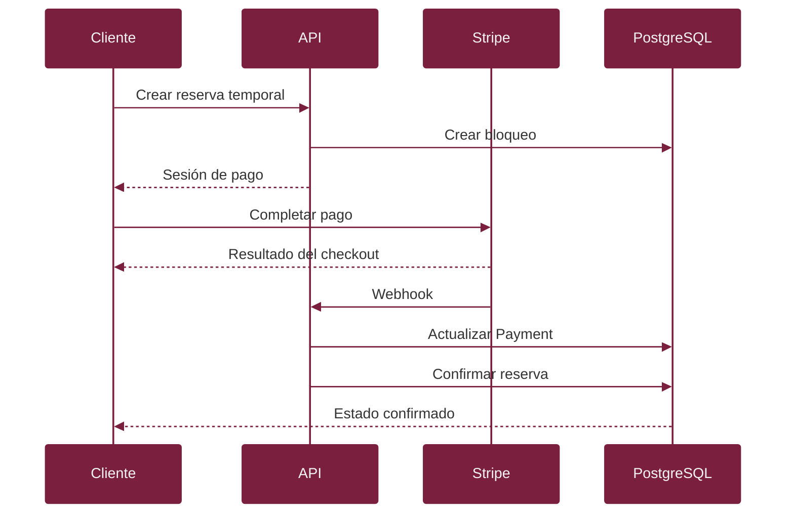

### Control de acceso

El empleado valida cada entrada escaneando el QR. La validación comprueba la existencia del código, la reserva asociada, su estado confirmado, la fecha, la hora y el uso previo.

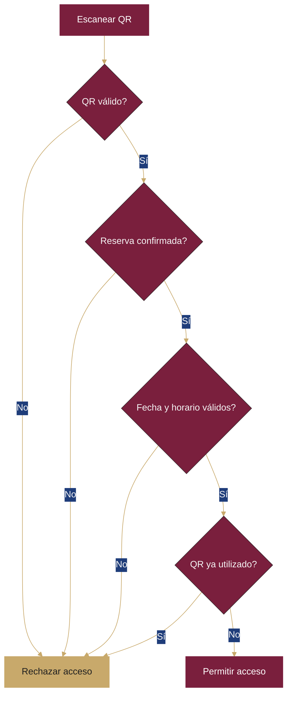


## Referencia API

Base: mismo origen, prefijo `/api`. Todas las respuestas usan el formato `{ "data": T | null, "error": { "code", "message" } | null }`. La sesión viaja en cookie `HttpOnly` (`credentials: "include"` en el cliente).

| Método | Ruta | Descripción |
|---|---|---|
| POST | `/api/auth/register` | Crea `User` + `Customer`, deja sesión activa (`201`) |
| POST | `/api/auth/login` | Inicia sesión (`200`) |
| POST | `/api/auth/logout` | Cierra sesión e invalida la cookie |
| GET | `/api/auth/me` | Usuario actual (`401` sin sesión) |
| POST | `/api/auth/forgot-password` | `501`: pendiente de proveedor de correo |
| POST | `/api/auth/reset-password` | `501`: pendiente de proveedor de correo |
| POST | `/api/auth/resend-verification` | `501`: la verificación no bloquea el acceso |
| GET · POST | `/api/categories` | Lista y crea categorías |
| GET · POST | `/api/facilities` | Lista y crea instalaciones |
| GET · PATCH · DELETE | `/api/facilities/[id]` | Detalle, actualización y borrado |
| GET | `/api/availability` | Disponibilidad por servicio y fecha |
| GET | `/api/pools` · `/api/pools/[id]` | Catálogo de piscinas (datos locales) |
| GET · POST | `/api/reservations` | Lista y crea reservas |
| GET · DELETE | `/api/reservations/[id]` | Detalle y cancelación |
| POST | `/api/payments/webhook` | Webhook de Stripe (fuente de verdad del pago) |
| POST | `/api/access/validate` | Validación de QR en puerta |

Códigos: `200` OK · `201` creado · `400` validación · `401` no autenticado · `403` rol insuficiente · `404` no encontrado · `409` conflicto (email/documento duplicado) · `501` no implementado · `500` error interno.

### Modelo de datos

Fuente de verdad: `prisma/schema.prisma` (PostgreSQL). Resumen por dominio:

| Dominio | Modelos |
|---|---|
| Identidad | `Role`, `User`, `Customer` (documento único, fecha de nacimiento), `Employee`, `OAuthAccount`, `EmailVerification`, `PasswordReset` |
| Catálogo | `Category`, `Service`, `ServiceSchedule`, `ServiceClosure`, `ServiceSlot` (cupos y bloqueos por franja) |
| Reservas | `Reservation` (estado, canal, cantidad, total), `ReservationSlot`, `ReservationHold` (bloqueo temporal con expiración) |
| Pagos | `Payment` (método, estado, ids de Stripe), `StripeEvent` (idempotencia por `eventId`) |
| Acceso | `QrToken` (hash único, estado), `Access` (resultado, motivo, empleado, brazalete) |


## Identidad visual

La interfaz busca una estética deportiva, moderna, elegante y profesional. El dorado funciona únicamente como acento.

<table>
<tr>
<td align="center" width="16.6%"><br /><strong>Primary</strong><br /><code>#7A1F3D</code></td>
<td align="center" width="16.6%"><br /><strong>Accent</strong><br /><code>#C8A96B</code></td>
<td align="center" width="16.6%"><br /><strong>Background</strong><br /><code>#F5F5F5</code></td>
<td align="center" width="16.6%"><br /><strong>Text</strong><br /><code>#1F1F1F</code></td>
<td align="center" width="16.6%"><br /><strong>Secondary</strong><br /><code>#6B7280</code></td>
<td align="center" width="16.6%"><br /><strong>Border</strong><br /><code>#E5E7EB</code></td>
</tr>
</table>


## Instalación

**Requisitos:** Node.js, npm y una base de datos PostgreSQL o Supabase.

```bash
# 1. Clonar
git clone <REPOSITORY_URL>
cd omega-complex

# 2. Instalar dependencias
npm install

# 3. Configurar variables de entorno
cp .env.example .env

# 4. Migrar y poblar la base de datos
npx prisma migrate dev
npx prisma db seed

# 5. Ejecutar
npm run dev
```

La aplicación queda disponible en `http://localhost:3000`.

<details>
<summary><strong>Variables de entorno</strong></summary>

<br />

| Variable                | Descripción                               |
| ----------------------- | ----------------------------------------- |
| `DATABASE_URL`          | Conexión PostgreSQL                       |
| `JWT_SECRET`            | Secreto utilizado para firmar JWT         |
| `STRIPE_SECRET_KEY`     | Clave privada de Stripe                   |
| `STRIPE_WEBHOOK_SECRET` | Firma del webhook                         |
| `ADMIN_*`               | Variables relacionadas con administración |

Los valores reales nunca deben almacenarse en el repositorio.

</details>

<details>
<summary><strong>API</strong></summary>

<br />

La API forma parte del mismo proyecto Next.js, en `src/app/api/`. No se requiere un backend externo ni `NEXT_PUBLIC_API_URL`.

```text
/api/auth/*
/api/access/validate
/api/availability
/api/categories
/api/facilities
/api/pools
/api/reservations
/api/payments/webhook
```

</details>

<details>
<summary><strong>Docker</strong></summary>

<br />

La aplicación usa una estrategia multistage. La imagen de producción corre con un usuario no privilegiado y expone el puerto `3000`.

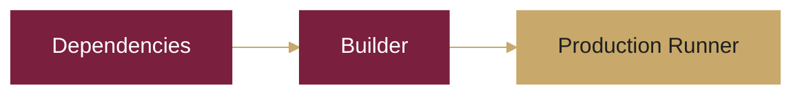

</details>


## Desarrollo

### Flujo para una nueva funcionalidad

```mermaid
%%{init: {'theme':'base','themeVariables':{'primaryColor':'#7A1F3D','primaryTextColor':'#F5F5F5','lineColor':'#C8A96B'}}}%%
flowchart LR
    A[Requerimiento] --> B[Analizar dominio] --> C[Tipos] --> D[Validación Zod] --> E[Service] --> F[Repository]
    F --> G[API] --> H[UI con Axios] --> I[Loading, error, success] --> J[Tests] --> K[Lint y build]
    classDef primary fill:#7A1F3D,color:#fff,stroke:#7A1F3D;
    classDef accent fill:#C8A96B,color:#1F1F1F,stroke:#C8A96B;
    class A,B,C,D,E,F primary;
    class G,H,I,J,K accent;
```

### Convenciones

* TypeScript estricto. Evitar `any`.
* Si una funcionalidad pertenece a un dominio existente, se incorpora dentro de su feature. No se crean capas paralelas.
* Antes de crear un componente: revisar los existentes, evaluar si se puede reutilizar, extenderlo si corresponde y crear uno nuevo solo con una responsabilidad clara.

```text
features/
└── reservations/
    ├── components/
    ├── repository.ts
    ├── schemas.ts
    ├── service.ts
    ├── types.ts
    └── index.ts
```

### Validación antes de un commit importante

```bash
npm run lint
npm run build
npm test
npm run test:e2e
```

| Herramienta | Cobertura                               |
| ----------- | --------------------------------------- |
| Vitest      | Services, schemas y lógica de negocio   |
| Playwright  | Autenticación, reservas, pagos y acceso |


## Seguridad

<table>
<tr>
<td width="50%" valign="top">

**Implementado**

* Hash de contraseñas con `bcryptjs`.
* JWT con `jose`.
* Cookies `HttpOnly` y `SameSite=Lax`.
* Validación con Zod.
* Middleware de autorización.
* Control de acceso basado en roles.
* Variables sensibles mediante `.env`.

</td>
<td width="50%" valign="top">

**Pendiente antes de producción**

* Rate limiting.
* Hardening de autenticación.
* Proveedor de correo transaccional.
* Recuperación de contraseña y verificación de correo.
* Configuración definitiva de Stripe.
* Pruebas E2E de flujos críticos.
* Observabilidad y logging.

</td>
</tr>
</table>


## Roadmap

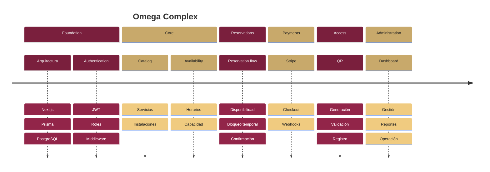

### Alcance del MVP

<table>
<tr>
<td width="50%" valign="top">

**Incluido**

* Autenticación y roles.
* Catálogo, servicios e instalaciones.
* Disponibilidad.
* Reservas y pagos.
* QR y control de acceso.
* Gestión administrativa.

</td>
<td width="50%" valign="top">

**Fuera del MVP**

* Membresías y suscripciones.
* Puntos y marketplace.
* Reconocimiento facial.
* Hardware de acceso.
* Aplicación móvil nativa.
* Modo offline.
* Múltiples sedes.
* Facturación electrónica.
* WhatsApp.

</td>
</tr>
</table>


## Licencia

Este proyecto es de uso privado y forma parte del desarrollo de **Omega Complex**.

<br />

<div align="center">

**Omega Complex**

Plataforma digital para una experiencia deportiva más simple, conectada y eficiente.

</div>