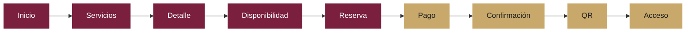
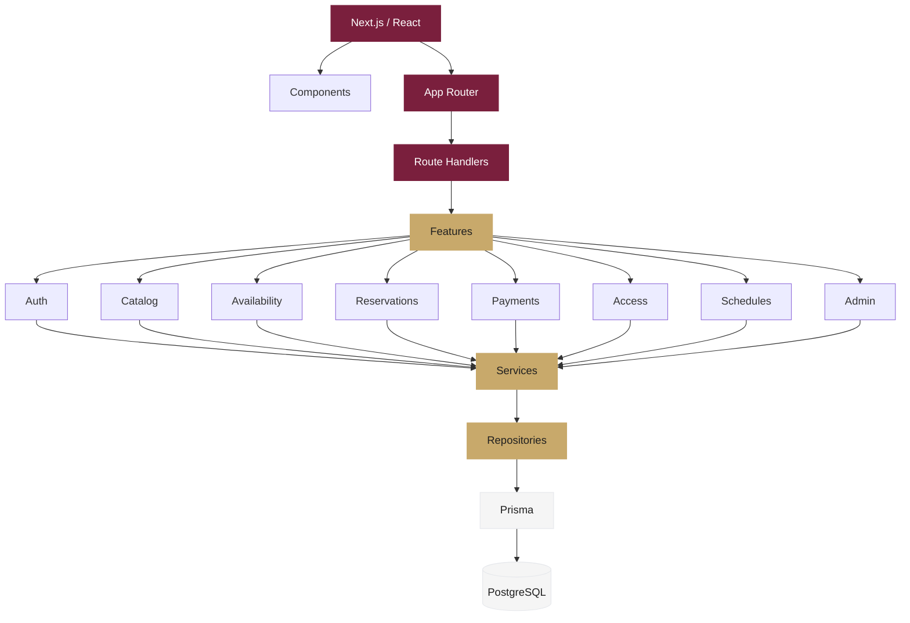
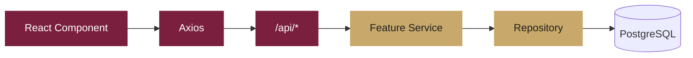
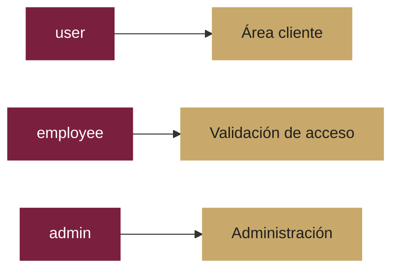
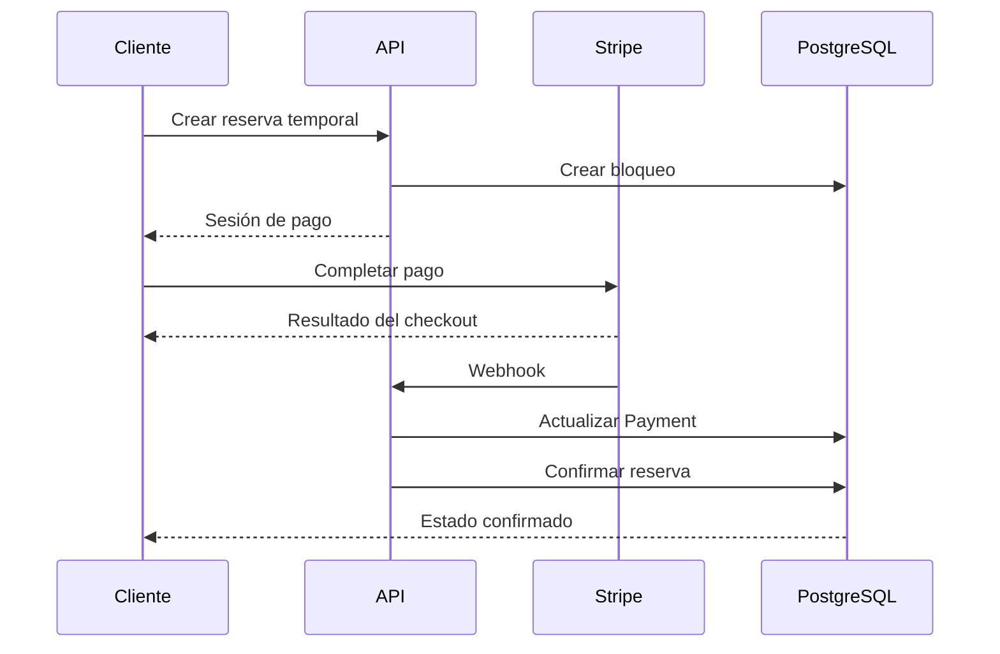
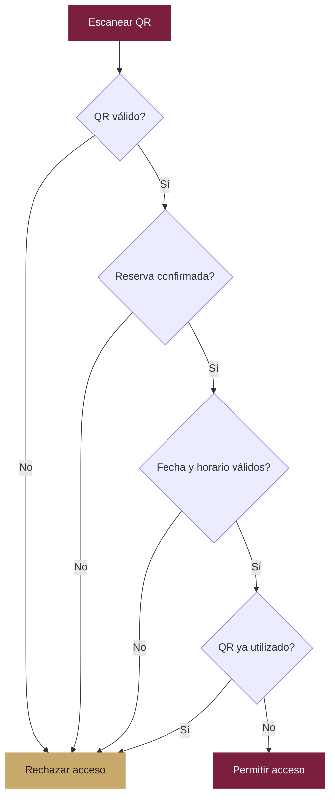
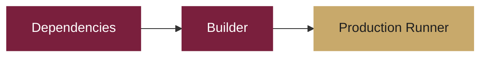
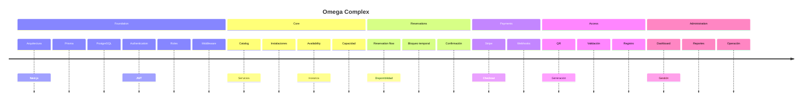

# Omega Complex

<p align="center">
  
</p>

<p align="center">
  <strong>Plataforma web para la gestión, reserva y control de acceso de un complejo deportivo y recreativo.</strong>
</p>

<p align="center">
  <a href="#características">Características</a>
  ·
  <a href="#arquitectura">Arquitectura</a>
  ·
  <a href="#stack-tecnológico">Stack</a>
  ·
  <a href="#instalación">Instalación</a>
  ·
  <a href="#desarrollo">Desarrollo</a>
</p>

<p align="center">
  
  
  
  
  
  
</p>

---

## Sobre el proyecto

**Omega Complex** es una aplicación web orientada a digitalizar la experiencia de un complejo deportivo y recreativo.

La plataforma conecta en un mismo ecosistema:

* Catálogo de servicios e instalaciones.
* Consulta de disponibilidad.
* Reservas por fecha y horario.
* Pagos en línea.
* Generación y validación de códigos QR.
* Control de acceso.
* Gestión administrativa.
* Gestión de usuarios, servicios, horarios y reservas.

El objetivo principal es construir una experiencia donde el usuario pueda pasar de consultar un servicio a completar su reserva con la menor fricción posible.

---

## Experiencia del usuario



### Flujo de reserva

La experiencia de reserva sigue un flujo controlado:

```text
Servicio
   │
   ▼
Fecha y horario
   │
   ▼
Información de reserva
   │
   ▼
Bloqueo temporal — 10 minutos
   │
   ▼
Pago
   │
   ├──────── Pago rechazado ────────► Liberar disponibilidad
   │
   ▼
Pago confirmado
   │
   ▼
Reserva confirmada
   │
   ▼
Código QR
```

La disponibilidad y el estado definitivo de una reserva son responsabilidad del backend.

---

# Características

## Cliente

| Funcionalidad              |     Estado    |
| -------------------------- | :-----------: |
| Registro                   |   Disponible  |
| Inicio de sesión           |   Disponible  |
| Recuperación de contraseña | En desarrollo |
| Verificación de correo     | En desarrollo |
| Consulta de servicios      |   Disponible  |
| Consulta de disponibilidad |   Disponible  |
| Reservas                   | En desarrollo |
| Pagos                      | En desarrollo |
| Código QR                  | En desarrollo |
| Mis reservas               | En desarrollo |
| Historial de reservas      | En desarrollo |
| Perfil                     |   Disponible  |

## Empleado

| Funcionalidad         |     Estado    |
| --------------------- | :-----------: |
| Autenticación por rol |   Disponible  |
| Escaneo de QR         | En desarrollo |
| Validación de reserva | En desarrollo |
| Validación de horario | En desarrollo |
| Registro de acceso    | En desarrollo |

## Administrador

| Funcionalidad            |     Estado    |
| ------------------------ | :-----------: |
| Dashboard                | En desarrollo |
| Gestión de servicios     | En desarrollo |
| Gestión de instalaciones | En desarrollo |
| Gestión de horarios      | En desarrollo |
| Gestión de reservas      | En desarrollo |
| Gestión de empleados     | En desarrollo |
| Información operativa    | En desarrollo |

---

# Arquitectura

Omega Complex utiliza una arquitectura organizada por dominios mediante **vertical slices**.



### Principio de separación

```text
Presentation
     │
     ▼
Route Handler
     │
     ▼
Feature Service
     │
     ▼
Repository
     │
     ▼
Prisma
     │
     ▼
PostgreSQL
```

Cada capa tiene una responsabilidad específica.

Las páginas y componentes no deben contener lógica de negocio compleja ni acceder directamente a Prisma.

---

# Estructura

```text
src/
│
├── app/
│   ├── (auth)/
│   │   ├── forgot-password/
│   │   ├── login/
│   │   ├── register/
│   │   ├── reset-password/
│   │   └── verify-email/
│   │
│   ├── (customer)/
│   │   └── reservas/
│   │
│   ├── (employee)/
│   │   └── validar/
│   │
│   ├── (piscinas)/
│   │   ├── informacion/
│   │   ├── mis-reservas/
│   │   ├── perfil/
│   │   ├── piscinas/
│   │   ├── servicios/
│   │   └── tour/
│   │
│   ├── (public)/
│   │
│   └── api/
│       ├── access/
│       ├── auth/
│       ├── availability/
│       ├── categories/
│       ├── facilities/
│       ├── payments/
│       ├── pools/
│       └── reservations/
│
├── components/
│   ├── auth/
│   ├── piscinas/
│   └── ui/
│
├── features/
│   ├── access/
│   ├── admin/
│   ├── auth/
│   ├── availability/
│   ├── catalog/
│   ├── payments/
│   ├── reservations/
│   └── schedules/
│
├── lib/
│   ├── api/
│   └── piscinas/
│
├── shared/
│   ├── auth/
│   ├── http/
│   ├── lib/
│   └── ui/
│
├── types/
│   ├── auth.ts
│   └── piscinas/
│
└── middleware.ts
```

---

# Stack tecnológico

| Categoría      | Tecnología             |
| -------------- | ---------------------- |
| Framework      | Next.js App Router     |
| Frontend       | React 19.2             |
| Lenguaje       | TypeScript 5 — strict  |
| Styling        | Tailwind CSS v4        |
| UI             | shadcn/ui              |
| Iconografía    | Lucide React           |
| Animaciones    | Motion                 |
| Formularios    | React Hook Form        |
| Validación     | Zod                    |
| Cliente HTTP   | Axios                  |
| Estado global  | Zustand                |
| Fechas         | date-fns               |
| Calendario     | React Day Picker       |
| Notificaciones | Sonner                 |
| QR             | qrcode.react           |
| Gráficas       | Recharts               |
| Backend        | Next.js Route Handlers |
| ORM            | Prisma 6.19            |
| Database       | PostgreSQL / Supabase  |
| Auth           | jose + bcryptjs        |
| Payments       | Stripe                 |
| Unit testing   | Vitest                 |
| E2E            | Playwright             |

---

# Comunicación HTTP

El proyecto utiliza **Axios** como cliente HTTP.

No se utiliza TanStack Query inicialmente.

La comunicación sigue una estructura sencilla:



Esto mantiene la comunicación con el backend simple y coherente con la arquitectura actual.

Si posteriormente aparecen necesidades importantes de caché, revalidación, polling o sincronización avanzada de server state, se podrá evaluar la incorporación de una herramienta especializada.

---

# Autenticación

Omega Complex implementa autenticación propia.

### Tecnologías

* `bcryptjs` para contraseñas.
* `jose` para JWT.
* Cookies `HttpOnly`.
* `SameSite=Lax`.
* JWT con duración de 7 días.
* Middleware para protección de rutas.
* Autorización basada en roles.

### Roles



### Rutas principales

| Rol           | Ruta                  |
| ------------- | --------------------- |
| Usuario       | `/piscinas/inicio`    |
| Empleado      | `/validar`            |
| Administrador | `/piscinas/dashboard` |

---

# Reservas

Las reservas dependen de múltiples variables:

```text
Servicio
   +
Fecha
   +
Horario
   +
Capacidad
   +
Reservas existentes
   +
Bloqueos temporales
   +
Estado de la reserva
   ↓
Disponibilidad
```

### Reglas

| Regla                | Valor         |
| -------------------- | ------------- |
| Anticipación máxima  | 3 meses       |
| Horario              | 08:00 – 17:00 |
| Mantenimiento        | Lunes         |
| Duración del bloqueo | 10 minutos    |
| Cobro                | Por hora      |

Si un lunes es festivo, el mantenimiento se desplaza al martes.

---

# Pagos

Stripe será utilizado como proveedor de pagos.

El estado de una reserva no se confirma únicamente por el retorno del navegador después del checkout.



El webhook constituye la fuente de verdad para la confirmación del pago.

---

# Control de acceso

El empleado puede validar una entrada mediante QR.



La validación considera:

* Existencia del QR.
* Reserva asociada.
* Estado confirmado.
* Fecha.
* Hora.
* Uso previo del QR.

---

# Diseño

La identidad visual utiliza una combinación de:

```text
Primary
#7A1F3D

Background
#F5F5F5

Text
#1F1F1F

Secondary
#6B7280

Border
#E5E7EB

Accent
#C8A96B
```

La interfaz busca una estética deportiva, moderna, elegante y profesional.

El color dorado funciona únicamente como elemento de acento.

---

# Instalación

## Requisitos

* Node.js
* npm
* PostgreSQL o Supabase

## Clonar

```bash
git clone <REPOSITORY_URL>
cd omega-complex
```

## Instalar dependencias

```bash
npm install
```

## Variables de entorno

```bash
cp .env.example .env
```

Configurar:

```env
DATABASE_URL="postgresql://..."
JWT_SECRET="..."
```

Las variables adicionales de Stripe y administración deben configurarse según el entorno.

## Migraciones

```bash
npx prisma migrate dev
```

## Seed

```bash
npx prisma db seed
```

## Ejecutar

```bash
npm run dev
```

Aplicación:

```text
http://localhost:3000
```

---

# API

La API forma parte del mismo proyecto Next.js.

```text
src/app/api/
```

Principales endpoints:

```text
/api/auth/*
/api/access/validate
/api/availability
/api/categories
/api/facilities
/api/pools
/api/reservations
/api/payments/webhook
```

No se requiere un backend externo ni `NEXT_PUBLIC_API_URL`.

---

# Validación

Antes de realizar un commit importante:

```bash
npm run lint
npm run build
npm test
npm run test:e2e
```

### Tests

```text
Vitest
  │
  ├── Services
  ├── Schemas
  └── Business logic

Playwright
  │
  ├── Authentication
  ├── Reservations
  ├── Payments
  └── Access
```

---

# Variables de entorno

| Variable                | Descripción                               |
| ----------------------- | ----------------------------------------- |
| `DATABASE_URL`          | Conexión PostgreSQL                       |
| `JWT_SECRET`            | Secreto utilizado para firmar JWT         |
| `STRIPE_SECRET_KEY`     | Clave privada de Stripe                   |
| `STRIPE_WEBHOOK_SECRET` | Firma del webhook                         |
| `ADMIN_*`               | Variables relacionadas con administración |

Los valores reales nunca deben almacenarse en el repositorio.

---

# Docker

La aplicación utiliza una estrategia multistage:



La imagen de producción utiliza un usuario no privilegiado y expone el puerto `3000`.

---

# Estado del proyecto

```text
Core
████████████████████████████████████████ 100%

Authentication
██████████████████████████████████░░░░░░  85%

Catalog
████████████████████████████████████░░░░  90%

Reservations
████████████████████████░░░░░░░░░░░░░░░░  60%

Payments
██████████████████░░░░░░░░░░░░░░░░░░░░░░  45%

Access
████████████████████░░░░░░░░░░░░░░░░░░░░  55%

Admin
████████████████░░░░░░░░░░░░░░░░░░░░░░░░  40%
```

> Los porcentajes anteriores son una representación visual del estado actual del desarrollo y deben actualizarse conforme avance la implementación.

---

# Roadmap



---

# Alcance del MVP

### Incluido

* Autenticación.
* Roles.
* Catálogo.
* Servicios.
* Instalaciones.
* Disponibilidad.
* Reservas.
* Pagos.
* QR.
* Control de acceso.
* Gestión administrativa.

### Fuera del MVP

* Membresías.
* Suscripciones.
* Puntos.
* Marketplace.
* Reconocimiento facial.
* Hardware de acceso.
* Aplicación móvil nativa.
* Modo offline.
* Múltiples sedes.
* Facturación electrónica.
* WhatsApp.

---

# Convenciones

## Código

El proyecto utiliza TypeScript estricto.

Se debe evitar:

```typescript
any
```

Las nuevas funcionalidades deben respetar la arquitectura existente.

## Nuevas features

Cuando una funcionalidad pertenece a un dominio existente, debe incorporarse dentro de su feature correspondiente.

```text
features/
└── reservations/
    ├── components/
    ├── repository.ts
    ├── schemas.ts
    ├── service.ts
    ├── types.ts
    └── index.ts
```

No crear capas paralelas si la funcionalidad ya tiene un lugar dentro de la arquitectura.

## Componentes

Antes de crear un componente nuevo:

1. Revisar componentes existentes.
2. Determinar si puede reutilizarse.
3. Extenderlo si corresponde.
4. Crear uno nuevo únicamente cuando tenga una responsabilidad clara.

---

# Desarrollo

El flujo recomendado para una nueva funcionalidad es:

```text
Requerimiento
      │
      ▼
Analizar dominio
      │
      ▼
Definir tipos
      │
      ▼
Definir validación
      │
      ▼
Implementar Service
      │
      ▼
Implementar Repository
      │
      ▼
Crear / actualizar API
      │
      ▼
Conectar UI con Axios
      │
      ▼
Estados de loading / error / success
      │
      ▼
Tests
      │
      ▼
Lint + Build
```

---

# Seguridad

Actualmente se utilizan:

* Hash de contraseñas mediante `bcryptjs`.
* JWT mediante `jose`.
* Cookies `HttpOnly`.
* `SameSite=Lax`.
* Validación mediante Zod.
* Middleware de autorización.
* Control de acceso basado en roles.
* Variables sensibles mediante `.env`.

Antes de producción se recomienda completar:

* Rate limiting.
* Hardening de autenticación.
* Proveedor de correo transaccional.
* Recuperación de contraseña.
* Verificación de correo.
* Configuración definitiva de Stripe.
* Pruebas E2E de flujos críticos.
* Observabilidad y logging.

---

# Licencia

Este proyecto es de uso privado y forma parte del desarrollo de **Omega Complex**.

---

<p align="center">
  <strong>Omega Complex</strong>
  <br />
  Plataforma digital para una experiencia deportiva más simple, conectada y eficiente.
</p>
