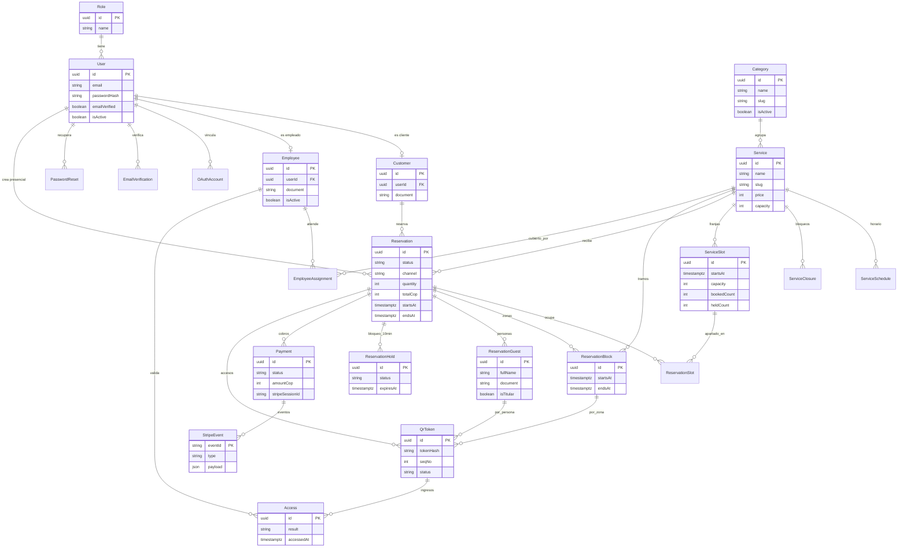

# Diagrama entidad–relación (MVP)

Fuente de verdad: `prisma/schema.prisma` (PostgreSQL). Generado el 2026-10-09
sobre la rama `feat/aseguramiento-mvp`.



## Reglas que el diagrama debe leerse con

- Un `ServiceSlot` nunca se sobrevende: `bookedCount`/`heldCount` solo se
  mueven con `UPDATE` condicionales evaluados por PostgreSQL.
- Un `ReservationHold` activo retiene cupos 10 minutos; al confirmar se
  consume (`consumed`), al fallar/expirar se libera (`released`).
- Un `QrToken` es único por `(reservationId, blockId, seqNo)`: un QR por
  persona **y** por zona, de un solo uso (`active` → `used` atómico).
- Solo se guarda el SHA-256 del token; el crudo viaja una vez por correo.
- `StripeEvent.eventId` es la clave de idempotencia del webhook.
```

